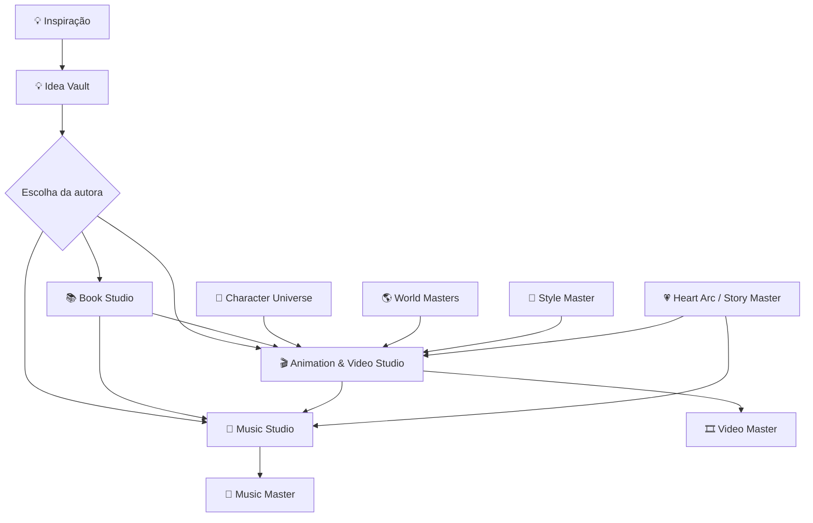

# 🎬🎵 FaithBloom Creative Studios — expansão multimídia

> Status: **fundação arquitetural implantada; geração final de vídeo/música ainda depende de provedores futuros.**

O FaithBloom pode evoluir de Estúdio Editorial Inteligente para **Creative Studio multimídia**, reaproveitando o mesmo universo aprovado em livros, HQs, audiobooks, animações, músicas e atividades.

## Princípio central

> **Praticidade sem perder o controle.**

Nenhuma adaptação multimídia deve reinventar silenciosamente personagens, cenários, estilo, história ou Masters aprovados. Operações caras continuam atrás de checkpoints humanos e Cost Gate.



## 💡 Idea Vault — fundação implantada

Objetivo: capturar ideias antes que se percam e só depois decidir o formato.

Entradas previstas: texto, tema, emoção, versículo/referência, imagem, documento e futuramente nota de voz. A ideia pode originar livro, HQ, animação, música, atividade, audiobook ou projeto híbrido.

Fluxo:

```text
💡 inspiração → Idea Master → possibilidades → escolha da autora → pipeline apropriado
```

A captura não deve iniciar geração cara automaticamente.

## 🎬 Animation & Video Studio — arquitetura registrada

Especialistas planejados:

- 🎥 Diretor de Animação;
- ✍️ Adaptador Livro → Roteiro Audiovisual;
- 🎞️ Diretor de Storyboard;
- 🎬 Diretor de Cena;
- 👤 Character Continuity Guardian;
- 🌎 World/Scenario Director;
- 🕺 Motion / Animation Director;
- 🗣️ Voice & Dialogue Director;
- 🔊 Sound Effects Director;
- 🎨 Color / Lighting Director;
- ✅ Video Quality Guardian.

Pipeline desejado:

```text
Book/Story Master ou Idea Master
        ↓
Roteiro audiovisual
        ↓ aprovação
Storyboard
        ↓ aprovação
Personagens + cenários + estilo aprovados
        ↓
Animatic / teste de movimento
        ↓ aprovação
Vozes + efeitos + música
        ↓ aprovação
Render final
        ↓
Video Quality Guardian
        ↓
🎞️ Video Master
```

O Animation Studio deve herdar Character DNA, Color Master, Reference Pack, World Masters e Style Master sempre que a obra fizer parte de um universo já existente.

## 🎵 Music Studio — arquitetura registrada

Especialistas planejados:

- 🎼 Compositor;
- ✍️ Letrista;
- 🎹 Arranjador;
- 👧 Children's Music Director;
- ✝️ Christian Music Director;
- 🎬 Film Score Composer;
- 🎤 Singing Voice Director;
- 🎚️ Mix & Master Engineer;
- 🛡️ Music Originality Guard;
- ✅ Music Quality Guardian.

Possibilidades:

- música de abertura de coleção/série;
- tema original de personagem;
- canção ligada à mensagem de uma história;
- trilha instrumental de animação;
- música de encerramento;
- canções educativas;
- canções cristãs originais;
- trilhas emocionais por cena.

Pipeline desejado:

```text
História / tema / personagem / ideia
        ↓
Briefing musical
        ↓ aprovação
Conceito + composição
        ↓
Letra, quando houver
        ↓ aprovação
Demo
        ↓ aprovação
Voz / interpretação / arranjo
        ↓
Mix & Master
        ↓
Music Originality Guard + QA
        ↓
🎼 Music Master
```

## 🛡️ Originalidade e direitos

O Creative Studio deve criar material original. Inspirações externas podem contribuir com temas, emoções e mecanismos abstratos, mas não autorizam copiar personagens, cenas distintivas, letras, melodias, vozes, gravações, identidade visual ou outros elementos protegidos.

O Music Originality Guard e o Originality & Ineditism Guard devem atuar antes da aprovação final. Esses controles são auxiliares internos e não equivalem a certificação jurídica mundial.

## 💰 Custos e provedores

A fundação é **provider-neutral**. Nenhum provedor de vídeo ou música é fixado nesta etapa. Quando a integração real for feita, o Orquestrador deverá comparar capacidade, qualidade, referência/consistência, custo e limites atuais antes de escolher o modo gratuito/econômico/premium/automático.

Antes de lote/render pago: estimativa → Cost Gate → aprovação conforme autonomia configurada.

## 🧭 Roadmap

- [x] Registrar Animation & Video Studio na arquitetura.
- [x] Registrar Music Studio na arquitetura.
- [x] Registrar Idea Vault na arquitetura.
- [x] Definir especialistas e checkpoints humanos.
- [x] Definir herança de Masters e guardrails compartilhados.
- [ ] Integrar Idea Vault à interface do Orquestrador.
- [ ] Criar modelos persistentes para projetos de vídeo e música.
- [ ] Criar UI moderna do Animation Studio.
- [ ] Criar UI moderna do Music Studio.
- [ ] Conectar provedor(es) de vídeo após avaliação técnica/custo.
- [ ] Conectar provedor(es) de música/áudio após avaliação técnica/custo.
- [ ] Implementar storyboard/animatic A/B/C.
- [ ] Implementar Music Originality Guard operacional.
- [ ] Integrar vídeo/música à Asset Library, fila, custos e QA.
- [ ] Integrar outputs ao Publishing/Distribution Center quando houver destinos compatíveis.

## Estado real

A presença de `creative_studios.py` significa que a **arquitetura e os contratos estão implantados**, não que o FaithBloom já consiga renderizar um desenho animado ou compor/renderizar uma música final. Essas capacidades só serão marcadas como implantadas depois de integração, testes e aprovação real.
