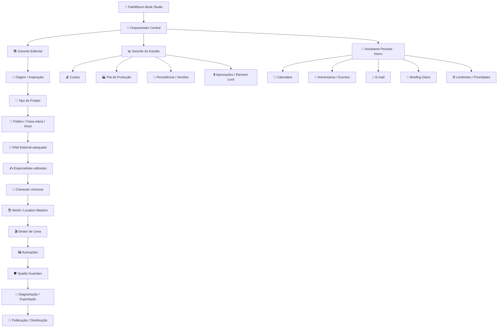
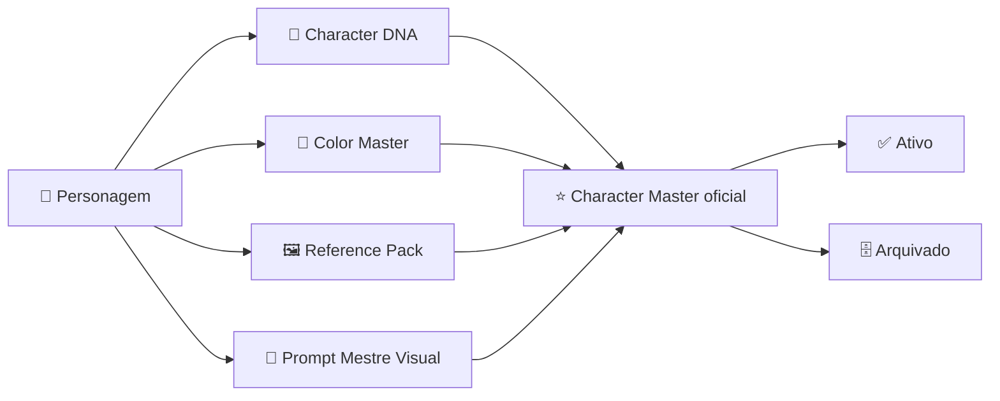
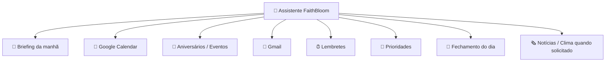

# 🌷 FaithBloom Book Studio

> **Estúdio editorial inteligente, visual e multimodal** — com controle humano, consistência de personagens, produção editorial, publicação e evolução futura para um assistente pessoal integrado.
>
> Autoria / direção do produto: **Erica Matsuzaki**

---

## ✨ Visão do produto

O FaithBloom Book Studio está evoluindo de um pipeline de livros infantis para um **Estúdio Editorial Inteligente** capaz de criar, revisar, restaurar, ilustrar, localizar, narrar e preparar diferentes tipos de publicações.

A experiência principal deve seguir uma regra simples:

> **Praticidade sem perder o controle.**

O usuário conversa com um **Orquestrador central**. Ele entende a intenção, escolhe os especialistas necessários, acompanha o estado do projeto, aplica guardrails de custo e qualidade e pede aprovação humana nos pontos críticos.

---

## 🧭 Legenda de status

| Status | Significado |
|---|---|
| ✅ Implantado | Existe no código atual da feature branch |
| 🟡 Parcial | Estrutura/controle existe, mas ainda falta integração completa |
| 🛠️ Próxima implantação | Planejado para as próximas etapas |
| 🔮 Futuro | Arquitetura prevista, ainda não implementada |

---

# 🧠 Arquitetura geral



---

# 🤖 1. Orquestrador FaithBloom — ✅ Implantado / 🟡 em expansão

Arquivo principal:

- `orchestrator_visual.py`
- `pages/0_🤖_Orquestrador_FaithBloom.py`

O Orquestrador atual já aplica o fluxo de pré-voo visual:

```text
História
   ↓ aprovação
Personagens principais
   ↓ aprovação
Cenários / World Masters
   ↓ aprovação
Style Master
   ↓ aprovação
Diretor de Cena
   ↓
Ilustrações
   ↓
QA
   ↓
Diagramação
   ↓
Publicação
```

### ✅ Controles já existentes

- aprovação explícita da história;
- aprovação dos personagens principais;
- reutilização de Character Masters existentes;
- candidata aprovada **não vira Master oficial automaticamente**;
- World / Location Master;
- Style Master;
- bloqueio do Diretor de Cena enquanto o universo visual não estiver pronto;
- controle de orçamento;
- modos de geração `free_first`, `economy`, `premium` e `automatic`;
- Element Lock para limitar exatamente o que pode mudar em uma imagem;
- histórico e persistência do plano visual.

### 🟡 Ainda falta conectar ao Orquestrador

- geração real de candidatas visuais de personagens;
- geração visual A/B/C de cenários;
- geração automática A/B/C do Diretor de Cena;
- geração do lote de ilustrações;
- edição visual real usando Element Lock + referências/máscaras compatíveis com o provedor.

---

# 📚 2. Tipos oficiais de projeto — 🛠️ Arquitetura aprovada para implantação

O FaithBloom não ficará limitado a Story Books. O Orquestrador deverá reconhecer os seguintes projetos:

| Tipo | Objetivo |
|---|---|
| 📖 História Infantil | Narrativa, personagens, Heart Arc, emoções, moral e fé quando aplicável |
| 🌿 História Inspirada na Vida Real | Experiência real com privacidade, consentimento e dignidade |
| 🧒 Conselhos para Crianças | Situações cotidianas, valores, reflexão e atividades |
| 🧑‍🎓 Conselhos para Adolescentes | Linguagem adequada, situações reais, reflexão e exercícios |
| 🙏 Devocional Infantil | Bíblia, reflexão, aplicação, oração/pergunta/desafio |
| 🙏 Devocional para Adolescentes | Estrutura devocional adaptada à adolescência |
| 🌱 Desenvolvimento Pessoal / Educativo | Hábitos, liderança, comunicação, dinheiro, emoções e outros temas |
| 📚 Livro de Estudos / Apostila | Conteúdo didático estruturado por assunto/nível |
| 🎓 Preparatório para Provas / Certificações | Teoria, exercícios, simulados e respostas comentadas |
| ✍️ Workbook / Caderno de Exercícios | Conteúdo + prática + espaços para respostas |
| 🧠 Guia de Estudos | Resumos, revisão, planejamento e exercícios |
| 🃏 Flashcards / Memorização | Texto, imagem, tradução, áudio e revisão quando aplicável |
| 🧩 Livro de Atividades | Labirintos, diferenças, tracejado, lógica, matching etc. |
| 🖍️ Livro de Colorir / Line Art | Line art infantil, juvenil, adulto ou personalizado |
| 🗯️ HQ / Quadrinhos | Roteiro, painéis, diálogos, SFX, continuidade e layout |
| ✨ Outro | Extensão aberta para novos formatos futuros |

### Projetos híbridos

O sistema deverá permitir combinações, por exemplo:

```text
🙏 Devocional
+ 🧑‍🎓 Adolescente
+ 📖 narrativa curta
+ ✍️ Workbook
```

ou:

```text
📚 Estudos
+ 🌍 Idiomas
+ 📖 História Infantil
+ 🙏 Conteúdo cristão
+ 🧩 Exercícios
+ 🎧 Áudio
```

---

# 🌱 3. Origem / Inspiração da obra — 🛠️ Planejado

A origem será independente do tipo de projeto.

Opções previstas:

- 📖 Bíblia / versículo / passagem;
- 💡 ideia própria;
- ❤️ experiência real;
- 🎬 filme, livro ou obra inspiradora;
- 🖼️ imagem;
- 📎 PDF / documento / material próprio;
- 🎯 tema / lição;
- 😊 emoção;
- 🤖 sugestão da IA.

### Regra para obras inspiradoras

O FaithBloom deve usar **tema, mecanismos narrativos, emoção e estrutura abstrata como inspiração**, sem copiar personagens, texto, sequência distintiva, voz autoral, franquia ou identidade visual de terceiros.

O **Originality & Ineditism Guard** permanece responsável por verificar riscos internos antes da publicação.

---

# 💗 4. Núcleo Editorial — ✅ Implantado

## FaithBloom Literary Excellence Charter

Princípios centrais:

- encantar antes de ensinar;
- a história precisa funcionar como história, não como sermão;
- emoções concretas e adequadas à idade;
- transformação por escolhas, tentativas, consequências e relações;
- fé natural, amorosa e não coercitiva;
- prazer de leitura, identificação, participação e releitura;
- originalidade;
- continuidade de personagem, coleção e universo.

## Heart Arc™ — ✅ Implantado

```text
✨ encantamento
      ↓
❤️ emoção
      ↓
🌱 experiência
      ↓
💡 descoberta
      ↓
🌷 transformação
      ↓
✝️ fé
```

## Emotional Experience Engine™ — ✅ Implantado

```text
acontecimento
   ↓
emoção / sensação
   ↓
reação
   ↓
escolha / tentativa
   ↓
consequência
   ↓
descoberta
   ↓
transformação
```

Faixas já previstas no núcleo infantil: `3–5`, `3–8`, `6–8` e `9–12`.

---

# ✍️ 5. Roteirista e estilos — ✅ Implantado

Os estilos formais compartilham a skill-base `storyteller`:

- 📖 Aventura;
- 🎵 Poético / Rimado;
- 🌿 Fábula Cristã;
- ✨ Misto;
- ⭐ Escolha do Roteirista.

Estilos/formas adicionais:

- 🔁 Cumulativo / Lengalenga;
- 😄 Cotidiano Cômico / Diário Visual;
- 🗯️ HQ infantil como formato visual sequencial.

### Regra de arquitetura

> **Estilo narrativo ≠ formato visual.**

Exemplo: Aventura + HQ ou Misto + HQ são combinações válidas.

---

# 👤 6. Character Universe — ✅ Implantado



### Segurança já implantada

- personagens com mesmo nome em coleções diferentes podem ser distinguidos;
- status oficial e coleção são preservados;
- arquivamento sem destruir DNA, assets, versões ou histórico;
- Masters com histórico não devem ser apagados permanentemente sem confirmação explícita;
- uma candidata nunca é automaticamente promovida a Master oficial.

## 🌸 Mel — referência canônica avançada

A Mel possui estrutura visual canônica específica:

- **Mel Eye Signature™**;
- **Heart Cheek Blush™**;
- **Bow Signature™**;
- Color Master;
- Reference Pack;
- Prompt Mestre Visual;
- cor de acessório contextual controlada.

### 🛠️ Próxima generalização

Levar o mesmo fluxo profissional de melhoria visual para qualquer personagem:

```text
Referências
   ↓
Análise de identidade
   ↓
3 candidatas
Conservadora | Refinada | Premium
   ↓
Comparação
   ↓
Aprovação humana
   ↓
Color Master oficial
   ↓
Reference Pack + Character DNA + Prompt Mestre Visual
```

---

# 🌎 7. World / Location Master — ✅ Implantado

Fluxo atual:

```text
Descrição do lugar
      ↓
World / Location Master draft
      ↓
👀 aprovação da autora
      ↓
Master aprovado
      ↓
vinculado ao projeto
```

O cenário não pode entrar no lote principal antes da aprovação.

---

# 🎬 8. Diretor de Cena A/B/C — 🟡 Estrutura pronta

Objetivo:

```text
Trecho da história
      ↓
🎬 Diretor de Cena
      ↓
A — curiosa / divertida
B — cinematográfica
C — alternativa criativa
      ↓
👀 escolha da autora
      ↓
ilustração
```

O Orquestrador já possui o **gate que decide quando o Diretor de Cena pode começar**, mas a geração automática das três propostas ainda será conectada.

---

# 🔒 9. Element Lock — ✅ Contrato implantado / 🟡 edição real a conectar

Elementos controláveis:

- 👤 personagens;
- 🧍 pose/composição;
- 😊 expressões;
- 👗 figurino;
- 🎨 estilo;
- 🌳 cenário;
- 💡 iluminação;
- 🔤 texto.

Exemplo:

```text
Pedido: "Troque somente o jardim da página 14"

🔒 personagem
🔒 pose/composição
🔒 expressão
🔒 roupa
🔒 estilo
🔓 cenário
🔒 iluminação
🔒 texto
```

O contrato é provider-neutral. A preservação visual real dependerá das capacidades do provedor de edição utilizado.

---

# 💰 10. Custos e segurança — ✅ Implantado

Modos de geração:

- 🆓 Gratuito primeiro;
- 💰 Econômico;
- 💎 Premium;
- 🤖 Automático.

Guardrails existentes:

- limite de orçamento por projeto;
- confirmação antes de operação paga;
- bloqueio de estouro silencioso de orçamento;
- limite de imagens por lote;
- cooldown contra clique duplicado;
- retry apenas em falhas transitórias;
- log sanitizado de geração;
- fila persistente com pause/continue/cancel;
- imagens geradas não são aprovadas automaticamente.

---

# 🩺 11. Book Doctor + Restoration Studio — ✅ Implantados

```text
📕 Livro existente
      ↓
🩺 Book Doctor
      ↓
Diagnóstico
 ┌────┼─────┐
Texto Imagem Capa/Layout
  │      │
  ▼      ▼
Revisão  ✨ Restoration Studio
              ↓
         Antes × Depois
              ↓
        Nova versão
```

Princípios:

- preservar sempre o original;
- criar derivados/versionamentos;
- suportar melhoria técnica, limpeza de line art, correção de personagem, reilustração e variações;
- usar Character Master e Style DNA como referências;
- não promover derivados a Master automaticamente.

---

# 🖍️ 12. Coloring Book Studio — ✅ Implantado

Suporta:

- criação de line art;
- upload de line art pronta;
- transformação de foto/ilustração em line art;
- reutilização de assets e personagens;
- presets de estilo;
- variações e histórico;
- verso em branco quando aplicável;
- preflight de impressão;
- integração com capa e PDF Print Ready.

---

# 🌍 13. Tradução e Localization Excellence — ✅ Implantado

O sistema trabalha por idioma/locale e busca preservar:

- Heart Arc;
- humor;
- musicalidade;
- refrões;
- onomatopeias;
- Character DNA;
- moral;
- referência bíblica.

Há especialização para japonês infantil / 絵本.

**Bible Guard:** texto bíblico protegido não deve ser inventado nem traduzido livremente sem fonte/versão aprovada.

---

# 🎧 14. Audiobook Studio — ✅ Base profissional implantada

Fluxo:

```text
Story / Translation Master
      ↓
Adaptação para áudio
      ↓
Pausas / emoção / ritmo
      ↓
Voice Profiles
      ↓
Pronúncia
      ↓
Previews A/B/C
      ↓
TTS
      ↓
QA técnico
      ↓
Master de áudio
      ↓
Aprovação humana
```

Audiobook é tratado como **derivado de uma obra narrativa**, não como tipo primário de livro.

---

# 🚀 15. Publicação e distribuição — ✅ Implantado em camadas

Inclui:

- preflight KDP;
- PDF Print Ready;
- capa física calculada matematicamente;
- metadados e pacote comercial;
- Quality Guardian;
- Platform Registry;
- Publishing & Distribution Center;
- estados `draft → submitted → processing → live` registrados sem fingir aprovação de terceiros;
- nenhuma publicação automática sem autorização.

Plataformas podem ser cadastradas/expandidas sem alterar o núcleo do SaaS.

---

# 💾 16. Persistência, biblioteca e versões — ✅ Implantado

Camadas existentes:

- storage `local`;
- storage `supabase`;
- Biblioteca de Versões Narrativas;
- AutoSave;
- Asset Library / Media Manager;
- personagens e referências;
- presets;
- PDFs, imagens e áudio;
- arquivamento seguro;
- recovery points;
- audit log sanitizado.

---

# 👩 17. Assistente pessoal do FaithBloom — 🔮 Futuro planejado

O Orquestrador também deverá funcionar como **assistente pessoal**, mantendo essa camada separada do motor editorial.



Objetivo de briefing futuro:

```text
Bom dia!

📅 Agenda de hoje
🎂 Aniversários / datas especiais
📚 Projetos FaithBloom
👀 Aprovações aguardando você
📩 Mensagens importantes
⚠️ Pendências
🎯 Prioridades recomendadas
```

### Integrações previstas

- Google Calendar;
- Gmail;
- contatos/calendários de aniversários quando autorizado;
- WhatsApp Business / Cloud API ou provedor compatível;
- TTS / voz;
- notícias e clima com fontes atuais.

Integrações externas devem usar autorização explícita, logs e confirmação para ações de alto impacto.

---

# 🤖 18. Modos de autonomia — 🔮 Planejado

### 👀 Assistente
Recomenda e espera aprovação.

### 🧭 Copiloto
Executa tarefas seguras e pede confirmação para decisões importantes.

### 🧑‍💼 Gerente
Acompanha projetos, organiza prioridades e executa rotinas previamente autorizadas.

### Sempre sob controle humano

- promoção de Character Master;
- exclusão permanente;
- publicação;
- gasto acima do limite;
- envio externo importante;
- alteração de trabalho já aprovado.

---

# 🖥️ 19. Direção de interface — FUTURÍSTICA, MODERNA E ACOLHEDORA

A interface-alvo deve combinar **tecnologia premium + estúdio editorial + sensação acolhedora**.

### Direção visual

- glassmorphism leve;
- superfícies limpas e translúcidas;
- gradientes suaves;
- teal / azul / lilás / dourado como linguagem visual coordenada;
- cards com status claros;
- microinterações suaves;
- tipografia limpa e moderna;
- ícones consistentes;
- luz/glow discreto, nunca cyberpunk pesado;
- desktop wide + boa adaptação mobile;
- foco em clareza e redução de menus técnicos.

### Home futura

```text
┌──────────────────────────────────────────────────────────────┐
│ 🌷 FaithBloom        🔍                     🔔      👤 Erica │
├──────────────┬───────────────────────────────────────────────┤
│ 🏠 Início    │                                               │
│ 📚 Livros    │              🤖 ASSISTENTE CENTRAL           │
│ ✨ Criar     │                                               │
│ 🔄 Revisar   │     "Conte sua ideia em uma frase e          │
│ 👤 Personag. │             eu cuido do resto."              │
│ 🎨 Imagens   │                                               │
│ 📝 Texto     │  ┌────────┐ ┌────────┐ ┌────────┐            │
│ 🚀 Publicar  │  │ Criar  │ │Revisar │ │Imagem  │            │
│ ⚙️ Mais      │  └────────┘ └────────┘ └────────┘            │
│              │                                               │
│              │  📚 Projetos recentes                        │
│              │  👀 Precisa da sua aprovação                 │
│              │  💰 Custos do mês                            │
│              │  📅 Agenda / briefing futuro                 │
└──────────────┴───────────────────────────────────────────────┘
```

### Sidebar alvo

```text
🏠 Início
📚 Meus livros
✨ Criar novo projeto
🔄 Revisar / Atualizar livro
👤 Personagens
🎨 Imagens e ilustrações
📝 Texto e revisão
🚀 Publicar
⚙️ Mais ferramentas
```

As páginas técnicas devem permanecer acessíveis em **Mais ferramentas / Avançado**, sem poluir a experiência principal.

---

# 🗺️ 20. Roadmap rastreável

## ✅ Implantado

- [x] Storyteller compartilhado
- [x] Heart Arc™
- [x] Emotional Experience Engine™
- [x] Originality & Ineditism Guard
- [x] histórias inspiradas na vida real como origem
- [x] Biblioteca de Versões Narrativas
- [x] Character Universe
- [x] Mel Character DNA + Color Master + Reference Pack
- [x] duplicate/archive safety de personagens
- [x] Book Doctor
- [x] Restoration Studio
- [x] Coloring Book Studio / Doctor
- [x] Localization Excellence
- [x] Audiobook Studio
- [x] Quality Guardian
- [x] Publishing Platform Engine
- [x] Publishing & Distribution Center
- [x] Asset Library / Media Manager
- [x] Supabase / storage configurável
- [x] fila de produção
- [x] custos e segurança
- [x] Orquestrador Visual
- [x] World / Location Master
- [x] Element Lock como contrato de edição
- [x] checkpoints de história/personagens/cenários/estilo

## 🛠️ Próximas implantações

- [ ] generalizar criação/melhoria profissional de personagens além da Mel
- [ ] conectar gerador real de candidatas de personagem
- [ ] gerar World Master A/B/C visualmente
- [ ] conectar Diretor de Cena A/B/C
- [ ] conectar geração de ilustrações ao Orquestrador
- [ ] integrar Element Lock ao editor real de imagem
- [ ] ampliar Orquestrador para Tipos de Projeto
- [ ] implementar Origem / Inspiração independente
- [ ] criar DNA editorial para Conselhos infantis
- [ ] criar Teen Editorial DNA
- [ ] criar Devotional DNA
- [ ] criar Study / Educational DNA
- [ ] criar Workbook / Guide / Flashcard flows
- [ ] consolidar HQ como formato visual
- [ ] simplificar sidebar / navegação principal

## 🔮 Assistente pessoal / integrações

- [ ] Home com assistente conversacional central
- [ ] briefing da manhã
- [ ] fechamento do dia
- [ ] Google Calendar
- [ ] aniversários e eventos
- [ ] Gmail
- [ ] inbox do assistente para anexos e comandos
- [ ] WhatsApp Business
- [ ] voz / TTS / STT
- [ ] prioridades pessoais + editoriais
- [ ] notícias e clima sob demanda
- [ ] modos Assistente / Copiloto / Gerente

---

# 🧪 Estado de desenvolvimento

Branch ativa de desenvolvimento:

```text
feature/refinamento-24-prompt-mestre-compliance
```

PR principal de refinamento:

```text
PR #18 — Draft
base: release/2.0.0-rc5-skills
```

A branch de release deve permanecer protegida durante o desenvolvimento. O PR só deve sair de Draft / ser mergeado após validação e autorização explícita.

---

# 🧱 Princípios não negociáveis

1. **Original primeiro:** nunca destruir silenciosamente o material enviado ou aprovado.
2. **Master é humano:** nenhum asset vira Character/Color/World Master automaticamente.
3. **Aprovar antes de gastar:** evitar produção em massa antes da aprovação do universo visual.
4. **Versões sempre:** regenerar cria alternativa/histórico, não apaga a anterior.
5. **Fé com naturalidade:** em obras cristãs, a fé acompanha a experiência e não substitui a história.
6. **Privacidade e dignidade:** especialmente em histórias reais e dados pessoais.
7. **Originalidade:** inspiração não é imitação.
8. **Custos visíveis:** sem gasto silencioso acima do limite.
9. **Publicação sob controle:** nenhum canal externo recebe publicação sem autorização adequada.
10. **Praticidade sem perder o controle.**

---

## ▶️ Execução local

```bash
pip install -r requirements.txt
streamlit run app.py
```

Secrets e credenciais devem permanecer fora do Git e configurados no ambiente/Streamlit Secrets.

---

## 🌷 Visão de longo prazo

O FaithBloom deverá permitir que a autora simplesmente diga:

> **“Quero criar um livro baseado neste versículo.”**

ou:

> **“Quero um livro de estudos para adolescentes.”**

ou:

> **“Revise meu livro publicado, preserve o original e melhore somente as imagens.”**

ou, no futuro:

> **“O que tenho na agenda hoje e quais projetos precisam da minha aprovação?”**

O Orquestrador deverá entender a intenção, montar o fluxo apropriado e conduzir especialistas, versões, aprovações, custos e publicação sem obrigar o usuário a conhecer a arquitetura interna.

---

**FaithBloom Book Studio**  
🌷 Editorial Intelligence · Character Consistency · Human Approval · Multiformat Publishing · Personal Assistance
